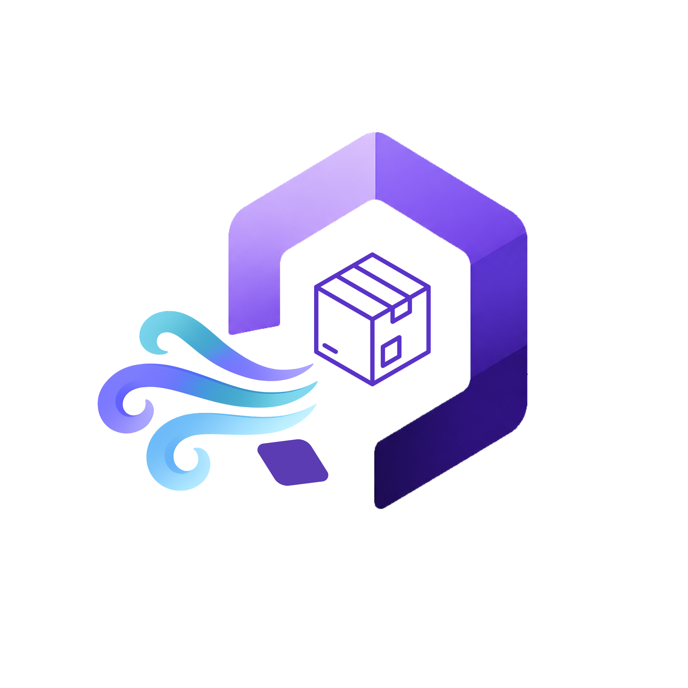

# <p align="center"><br>PETAYU</p>

<p align="center">
    <strong>Smart Storage, Smooth Flow</strong><br>
    Sistem Manajemen Pergudangan (WMS) Modern berbasis AI untuk efisiensi operasional maksimal.
</p>

<p align="center">
    
    
    
    
    
</p>

---

##  Tentang Petayu

**Petayu** adalah solusi *Warehouse Management System* (WMS) tingkat lanjut yang dirancang khusus untuk skala industri. Mengintegrasikan AI analitik dengan alur kerja pergudangan yang ketat, sistem ini memastikan akurasi inventaris, efisiensi distribusi, dan transparansi logistik melalui satu platform terpadu.

##  Fitur Unggulan

*    **Petayu AI (Groq Powered)**: Asisten AI interaktif dengan kemampuan suara (Piper TTS & Whisper STT).
*    **Dashboard Analitik**: Visualisasi KPI cerdas mencakup tren pergerakan stok dan efisiensi ruang gudang.
*    **Visualisasi Lantai (Heatmap)**: Pemetaan rak secara interaktif untuk memantau kapasitas zona.
*    **Procurement & Logistics**: Siklus lengkap mulai dari PO hingga manajemen pengiriman (Shipment).
*    **Role-Based Access Control**: Pembatasan akses ketat untuk Manager, Supervisor, Staff, dan Driver.
*    **Export Profesional**: Laporan terperinci dalam format Excel (.xlsx) dan PDF.

##  Matriks Peran & Akses (Backend Verified)

| Fitur / Modul | Manager | Supervisor | Staff | Driver |
| :--- | :---: | :---: | :---: | :---: |
| **Konfigurasi Sistem** |  |  |  |  |
| **Master Produk** |  |  |  |  |
| **Kelola Zona & Rak** |  |  |  |  |
| **Operasional PO** |  |  |  |  |
| **Audit/Opname** |  |  |  |  |
| **Stok Keluar** |  |  |  |  |
| **Dashboard** |  |  |  |  |
| **Driver API** |  |  |  |  |
| **Petayu AI** |  |  |  |  |

##  Tech Stack

*   **Backend:** Laravel 13 (PHP 8.3)
*   **Frontend:** React (Inertia.js 2.0)
*   **CSS:** Tailwind CSS 4.0
*   **Tools:** Vite 8.0, Playwright, Puppeteer

##  Instalasi Cepat

```bash
# 1. Clone & Setup
git clone https://github.com/username/inventori-pergudangan.git && cd inventori-pergudangan
composer install && npm install
cp .env.example .env && php artisan key:generate && php artisan migrate --seed

# 2. Jalankan
php artisan dev
```

##  Konfigurasi AI

```env
GROQ_API_KEY=gsk_your_key_here
GROQ_MODEL=llama-3.3-70b-versatile
```

##  Dokumentasi Alur

*   [Matriks Peran](ROLE_PERMISSION_MATRIX.md) | [Alur Transaksi](TRANSACTION_FLOW.md)
*   [Alur Pengiriman](DRIVER_FLOW.md) | [Manajemen Gudang](WAREHOUSE_FLOW.md)

---
<p align="center">© 2026 Petayu - Smart Storage, Smooth Flow</p>
