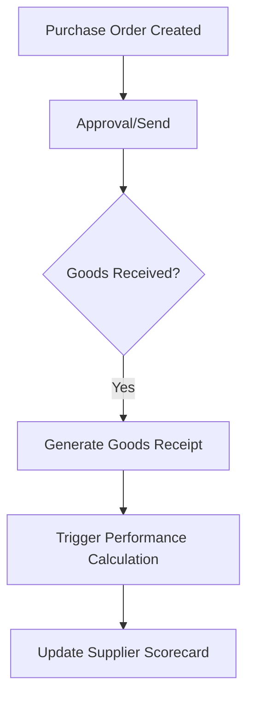

# Supplier Performance Architecture Flow

Dokumen ini menjelaskan alur kerja modul **Supplier Performance Analytics** yang mengintegrasikan transaksi logistik dengan penilaian performa partner secara *real-time*.

## 1. Data Source Lifecycle
Sistem tidak menggunakan input manual untuk penilaian, melainkan menarik data dari siklus hidup **Purchase Order (PO)**:

## 2. Performance Tracking Engine
Sistem menggunakan robot latar belakang (`Artisan Command`) yang bekerja secara otomatis:

- **Command**: `php artisan supplier:calculate-performance`
- **Trigger**: 
    - **Otomatis**: Setiap kali PO ditandai sebagai `received` di `PurchaseOrderController`.
    - **Manual**: Bisa dijalankan via terminal untuk sinkronisasi ulang data lama.
- **Source Table**: `goods_receipts` & `purchase_orders`.
- **Output Table**: `supplier_performances` (Menyimpan data per bulan/tahun).

## 3. Key Performance Indicators (KPI)
Sistem menghitung dua metrik utama untuk setiap supplier:

| Metrik | Logika Perhitungan |
| :--- | :--- |
| **Avg Lead Time** | Selisih hari antara `PO Date` dengan `Receipt Date` (Actual Arrival). |
| **On-Time Delivery** | Persentase barang yang sampai SEBELUM atau TEPAT pada `Expected Date`. |
| **Performance Score** | Gabungan bobot dari kecepatan kirim dan ketepatan waktu. |

## 4. Frontend Ecosystem (`Supplier.jsx`)
Tampilan dashboard menggunakan data dari `SupplierController` dengan fitur canggih:

### A. Dynamic Analytics
- **Correlation Chart**: Menampilkan tren *Lead Time* bulanan untuk semua supplier secara dinamis.
- **Trend Indicators**: Menampilkan kenaikan/penurunan performa dibanding bulan lalu (Up/Down arrows).

### B. Stateful Filtering
- **Category Filter**: Menyaring daftar partner berdasarkan kategori bisnis (Distributor, Specialist, dll).
- **Status Filter**: Menyaring partner aktif vs non-aktif.
- **Inertia Integration**: Filter menggunakan `preserveState`, sehingga URL berubah namun posisi scroll tetap terjaga.

## 5. Export Audit System
Fitur ekspor menggunakan library `ExcelJS` (Client-side) untuk menghasilkan laporan premium:

- **Template**: Mengikuti desain brand (Header Biru, Aksen Teks Cyan).
- **Content**: Menyertakan 11 kolom audit lengkap mulai dari kode partner hingga detail kontak.
- **Processing**: Dilakukan langsung di browser untuk kecepatan maksimal.

---
**Note**: Seluruh data performa di-generate berdasarkan transaksi riil, pastikan kolom `expected_date` pada PO terisi agar perhitungan *On-Time Delivery* akurat.
